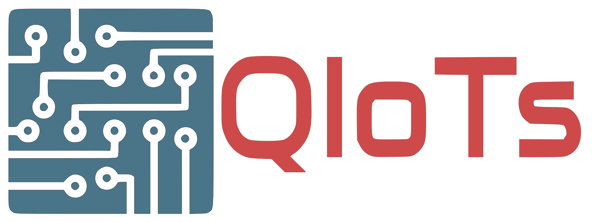

  
# Quick IoTs - One click app for Internet of Thing

## Why

Everyone with basic knowlede could build their own IOT device (sensor, control TV... ) without programming language

> This app starts as an editor for [Open MQTT Gateway](<https://github.com/1technophile/OpenMQTTGateway>). Then I think It could become more, a central hub for everyone, from amateur, hobbyist, student to build their own Internet of Thing device in just **one click.** 
> If you just want to use app, visit http://www.quickiots.com to download and give it a try

## Source code setup guide

- Install `Node.js`
- Clone source code,open cmd/shell, run: 
- `npm install`
- `npm install -g electron-forge`
- `npm install --global windows-build-tools` if not installed. In case error/stuck when installing, run `npm install --global --production windows-build-tools@4.0.0`. [Windows Vista / 7 only] requires `.NET Framework 4.5.1`
- Run `install.bat` or `install.sh` to install and rebuild `node-pty`
- `node_modules\.bin\electron-rebuild` to rebuild module for electron

## Develop guide

- Code is jQuery spaghetti. Sorry...
- Use Electronjs, run `npm start` to start app

## Deploy and Build

- Deploy for Web: Upload all file except `"modules"` folder
- Build for desktop app: Run `electron-forge make`. A folder name `out` will contain the build version

## API server
- This tool get JSON data of devices, fields... from a `PHP MYSQL API server`.
